# *Battleship*

A classic turn-based Battleship game, built with HTML, CSS, and JavaScript. Place your ships, take turns against the computer, and sink the enemy fleet!
Battleship is inspired by the well known game of the same name.

The game can be accessed via this [link](https://kerem-haeger.github.io/battleship/)

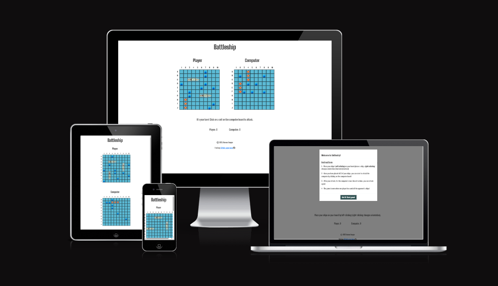

---

## User Stories

### First Time Visitor Goals:

* As a first-time visitor, I want to understand how to play the game, so that I know what actions to take.
* As a first-time visitor, I want to see clear instructions or a tutorial before the game starts.
* As a first-time visitor, I want to know which side is mine and which is the computer’s, so I don't get confused.
* As a first-time visitor, I want to be able to place my ships easily and intuitively using clicks or taps.

### Returning VisitorGoals:

* As a returning visitor, I want the interface to feel familiar so I can quickly start playing.
* As a returning visitor, I want to easily restart the game after finishing a round.
* As a returning visitor, I want to be able to browse more games by the programmer via their GitHub page.

### Frequent Visitor Goals:

* As a frequent visitor, I want to play the game across different devices, including mobile.
* As a frequent visitor, I want a smooth and fast reset option, so I can keep playing without friction.
* As a frequent visitor, I want a visually enjoyable experience, including suitable images/graphics for hits and misses.

---

## Features

+ ### Header

  * Displays the game title using a stylized font for a bold, thematic effect.

  

+ ### Instruction Modal

  * Bootstrap was used to generate the modal.
  * Gives clear instructions before the game begins.
  * Ensures the player reads the instructions, by starting all game mechanics on a confirmation button press

  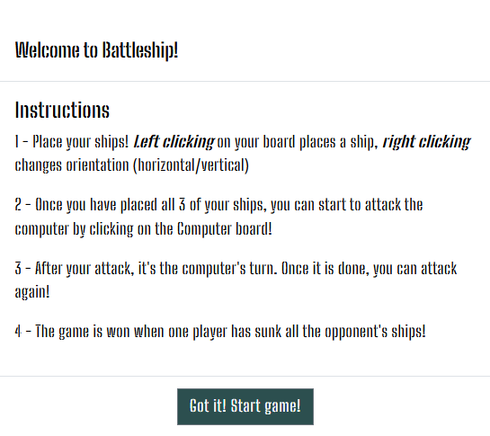

+ ### Main Game Area

  * Fully responsive layout that adjusts smoothly across different screen sizes.
  * Includes two game boards (Player and Computer) with clear legends (A–J and 1–10).
  * The computer board is only generated after the player places ships to avoid confusion.
  * Ships are placed visually using custom graphics.
  * Hit and miss indicators use distinct visuals for clarity.
  * Orientation hint appears on mobile after long-press to help the user understand rotation.
  * Includes a live-updating prompt to guide the player through each phase of the game.

  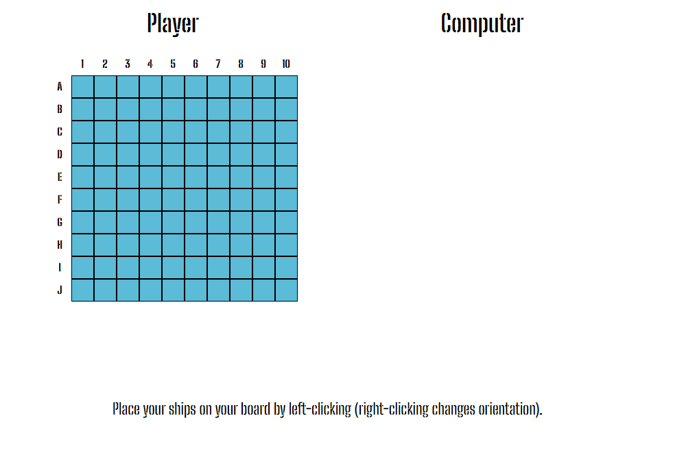
  

+ ### Footer

  * Fixed to the bottom of the screen.
  * Includes developer attribution and a link to my [GitHub](https://github.com/Kerem-Haeger)

  

+ ### End Game Modal

  * Bootstrap was used to generate the modal.
  * Announces the end of the game.
  * Adjusted depending on who wins the game.
  * Allows the user to restart the game by a simple button press.

  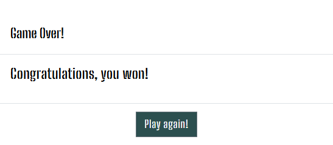
  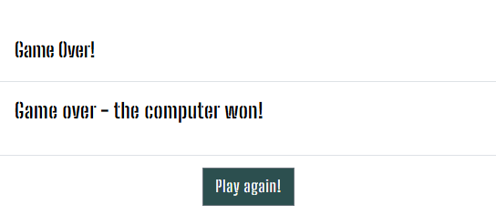

+ ### Game Functionality

  * Single Player Mode – Player vs. Computer.
  * Three 3-cell Ships per Player – Standardized ship length for simplicity and balanced gameplay.
  * Ship Placement System:
    * Horizontal/Vertical toggle using right-click (desktop) or long press (mobile).
    * Visual feedback while hovering for potential ship placement.
    * Prevents overlapping or touching ships.

  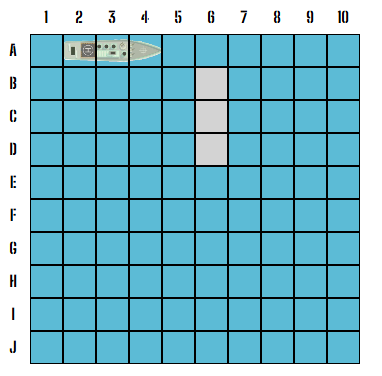
  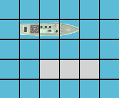

+ ### Game Mechanics

  * Hit & Miss Detection – Clear visual feedback for both the player and the computer.
  * Smart AI:
    * Random shots initially.
    * Prioritized targeting after a hit.
    * Recognizes when a ship is fully sunk and resets target logic.
  * Victory Detection – Game ends when one side has 9 hits (all ships sunk).
  * Reset Button – Appears after game ends, allows quick restart.

+ ### User Interaction

  * Interactive Prompts – Dynamic on-screen messages guide the user.
  * Clear Message Prompts - Prevent clicking on the same cell again.

  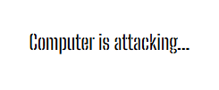
  
  

  * Focus Management – Helps with accessibility and modal control.

+ ### Mobile Compatibility

  * Responsive Design – Game layout adjusts to screen size.
  * Mobile Controls – Long press toggles orientation, optimized for touch.
  * Suggestions - Hint displayed to encourage the user to play on a larger screen for a better experience.

  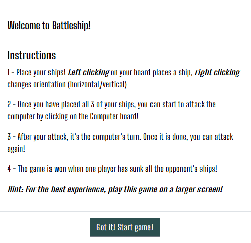

+ ### UX Features

  * Animated Hit Indicators – Background image swap for hits (like explosion graphic). 

  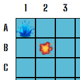

  * Ship Image Integration – Custom cartoon-style ships that span 3 cells.

  

  * Legend/Labels – Numbers (1–10) and letters (A–J) for board reference.
  * Accessible & Focusable – ARIA-compliant modals and focus control on reset.

+ ### Clean Reset

  * All variables, styles, and DOM content are reset cleanly.
  * Listeners don’t stack on reset (avoids performance issues or bugs).
  * Ships are re-randomized, and game flow restarts properly.

---
## Technologies Used

- [HTML](https://developer.mozilla.org/en-US/docs/Web/HTML) was used as the foundation.
- [CSS](https://developer.mozilla.org/en-US/docs/Web/css) was used to add the styles and layout.
- [JavaScript](https://developer.mozilla.org/en-US/docs/Web/JavaScript) was used for the logic.
- [VSCode](https://code.visualstudio.com/) was used as the main tool to write and edit code.
- [GitHub](https://github.com/) was used to host the code of the game.
- [Miro](https://miro.com/) was used to create a workflow diagram.

---
## Design

### General

The game is kept simplistic, which helps draw the players focus to the important game elements.

### Logic

In order to follow a coherent gameplay logic, Miro was used to create a workflow:

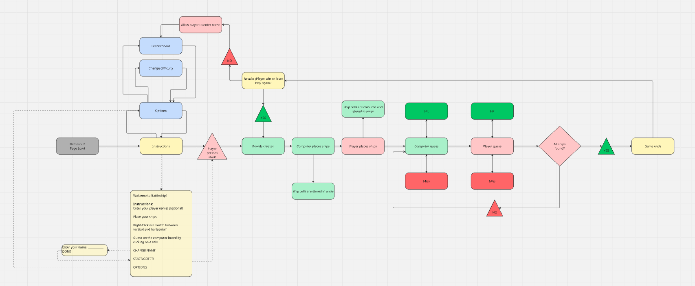

### File Architecture

- In order to create maintainable and sensible code, multiple JavaScript Files were used.

  - [**main.js**](assets/js/main.js) is called through the HTML, which starts off the game, handles DOMContentLoad, as well as the restart of the game via the Reset Button.
  - [**ui.js**](assets/js/ui.js) is used for creating the boards and other UI elements.
  - [**game.js**](assets/js/game.js) is used to handle most of the game logic, such as the computer placing ships and attacking.
  - [**events.js**](assets/js/events.js) is used to handle many of the event listeners used throughout the game
  - [**utils.js**](assets/js/utils.js) is a file that houses a variety of functions that might be called multiple times or are considered helper functions.

- Resetting of the game is handled in the various files where the variables are declared, which need to be reset in order to restart the game.

### Graphics

- Multiple elements are used to help make the game look more attractive.
The game boards are a simple, lightblue colour to mimick the ocean background.

- Ships are displayed using cartoon style images, which were cut into three equal pieces, in order to fill corresponding cells and enable rotation depending on ship orientation.

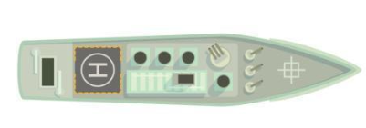

- Hits and misses are represented by graphics, that differ in colour and style, to quickly and effectively convey a hit or miss.

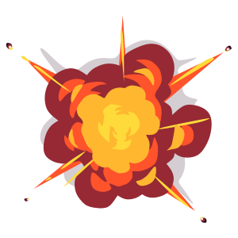 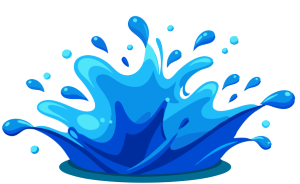

See [Credits](#credits) for image sources.

### Typography

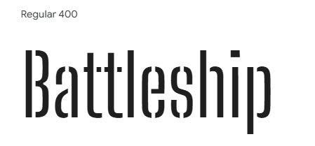

- Big Shoulders Stencil Google Font was used as the main font for the game to convey the overall style.

---

## Testing

Please refer to the [TESTING.md](TESTING.md) file for all test-related documentation.

---

## Deployment

### Deployment to GitHub Pages

- The site was deployed to GitHub pages. The steps to deploy are as follows: 
  - In the [GitHub repository](https://github.com/Kerem-Haeger/battleship), navigate to the Settings tab .
  - From the source section drop-down menu, select the **Main** Branch, then click "Save".
  - The page will be automatically refreshed with a detailed ribbon display to indicate the successful deployment.

The live link can be found [here](https://kerem-haeger.github.io/battleship/)

### Local Deployment

In order to make a local copy of this project, you can clone it.
In your IDE Terminal, type the following command to clone my repository:

- `git clone https://github.com/Kerem-Haeger/battleship.git`

- Alternatively, if you use Gitpod, you can [click here](https://gitpod.io/#https://github.com/Kerem-Haeger/battleship), which will start the Gitpod workspace for you.

---

## Future improvements

- Implement a difficulty setting that will alter how the computer chooses cells to attack.
- Enable the user to change the number of ships to play with and add an option to change ship length/size.
- Let the user customise the 'Player' Name displayed above the player board.
- Include customisable graphics, such as different hit/miss images or different ship looks (possibly even an 'old-school' mode, where sailboats are used).
- Implement a 'leaderboard', where the player can enter their name after the game to be included in a database of high performing players. High scores can be calculated by how many guesses were taken.
- Implement the option to play (locally or online) versus another player, instead of the computer.

---
## Credits

+ ### Content

    - Inspiration for this came from the game of the same name, now published by [Hasbro](https://products.hasbro.com/).

+ ### Media

    - Images and graphics for the game were taken from [Vecteezy](https://vecteezy.com/).
    - Icons were taken from [Fontawesome](https://fontawesome.com/).
    - The Favicon was taken from [Dribble](https://dribbble.com/), converted with [favicon.io](https://favicon.io/).

+ ### Tools

    - [Windows Photo App](https://www.microsoft.com/en-gb/windows/tips/photos-app) was used to split and resize graphics.

---

## Acknowledgments

- [Iuliia Konovalova](https://github.com/IuliiaKonovalova) as my mentor during this project for encouraging me to code the cleanest and most functional code, and for guiding me throughout the progress of this project.
- [Code Institute](https://codeinstitute.net/) tutors and Slack community members for their support and help.

---