# TESTING

## Compatibility

In order to confirm the correct functionality, responsiveness, and appearance:

+ The website was tested on the following browsers: Chrome, Firefox, Brave.

    - Chrome:

    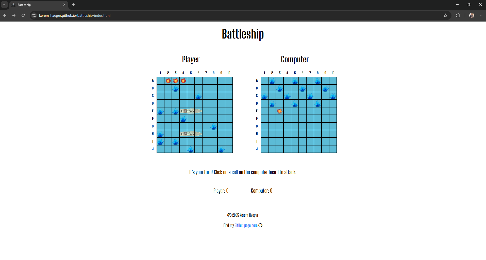

    - FireFox:

    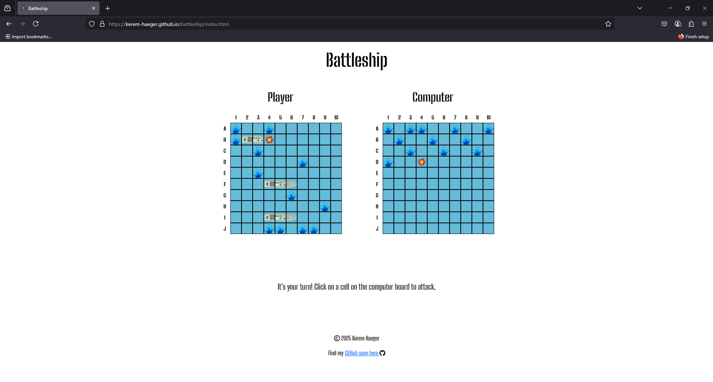

    - Opera:

    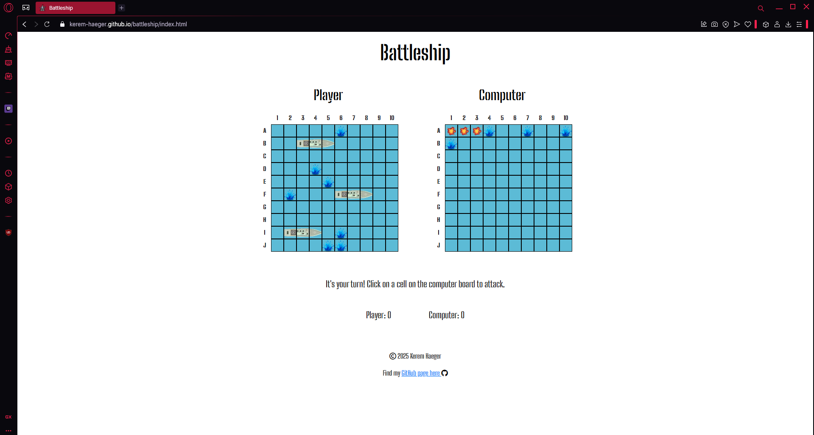

## Responsiveness

+ The website was checked using DevTools in browsers during development, but further using [Responsive Viewer](https://responsiveviewer.org/):

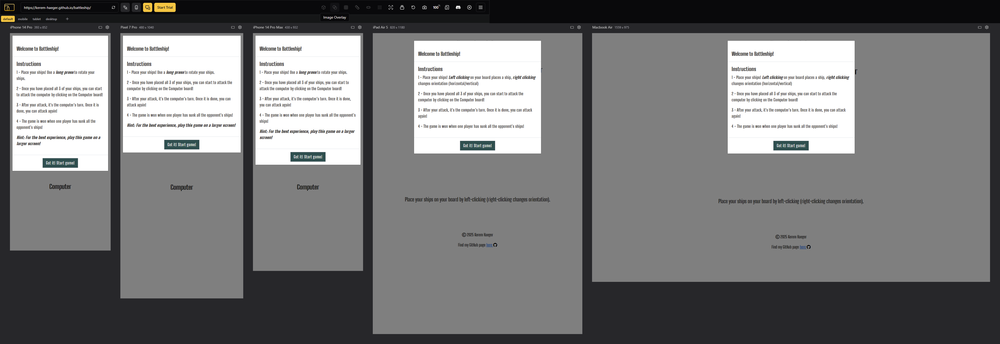
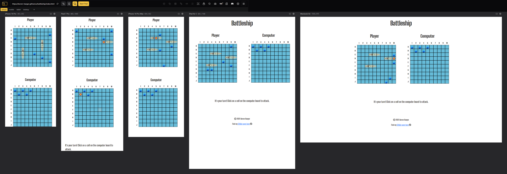

+ The functionality of the GitHub Link was checked and opened the correct page in a new tab.

## Manual testing

| Feature | Action | Expected Result | Tested | Passed | Comments |
| --- | --- | --- | --- | --- | --- |
| **Instruction Modal** | | | | | |
| Start Button | Click on the button | The modal is hidden and the game starts, first creating the player board | Yes | Yes | - |
|  | Clicking outside of the modal | No significant action should occur, the modal cannot be closed this way | Yes | Yes | - |
| **Main Game** | | | | | |
| Legend/Labels/Page | Click anywhere but the intended game area | Nothing should happen, elements outside the board should not be clickable | Yes | Yes | - |
| Player Board | Left-click on the board | Places player ship | Yes | Yes | - |
| Player Board | Hovering over the player board | Shows outline of ship, to indicate where it would be placed | Yes | Yes | - |
| Player Board | Right-click on the board | Rotates ship orientation (in hover) | Yes | Yes | Occasionally the mouse needs to be moved slightly for the effect to update |
| Computer Board | Left-click on the board | "Attacks" the computer, prompting either a hit or a miss and the corresponding graphic - This ends the player's turn| Yes | Yes | - |
| Computer Board | Left-click on a previously "attacked" cell | Player prompt updates, notifying the player to choose another cell - This does not end the player's turn | Yes | Yes | - |
| Computer Board | Right-click on the board | Nothing should happen, default prevented | Yes | Yes | - |
| **End Game Modal** | | | | | |
| Reset Button | Click on "Play again!" button | The game resets completely, allowing a clean restart | Yes | Yes | - |
|  | Clicking outside of the modal | No significant action should occur, the modal cannot be closed this way | Yes | Yes | - |
| **Footer** | | | | | |
| Link to GitHub | Click on "GitHub Page here" | The user is redirected to the GitHub page | Yes | Yes | - |
| GitHub Icon | Click on the GitHub icon | The user is redirected to the GitHub page | Yes | Yes | - |
| **Computer Logic** | | | | | |
| Computer Attack | - | The computer randomly attacks a cell, the relevant graphic is shown, the prompt is updated while the computer attacks | Yes | Yes | - |
| Computer Miss | - | The "miss" graphic is shown, the game continues as before | Yes | Yes | - |
| Computer Hit | - | The "hit" graphic is shown, the computer prioritises cells surrounding the hit cell for the next attacks, until the ship (3 cells) have been sunk | Yes | Yes | - |
| Computer Sinks Ship | - | The priority on adjecent cells gets reset and the computer continues to attack randomly | Yes | Yes | - |

---
## Validator testing
+ ### HTML
  
    - No errors or warnings were found when passing through the official W3C validator.

    

+ ### CSS
  - No errors were found when passing through the official W3C (Jigsaw) validator.

  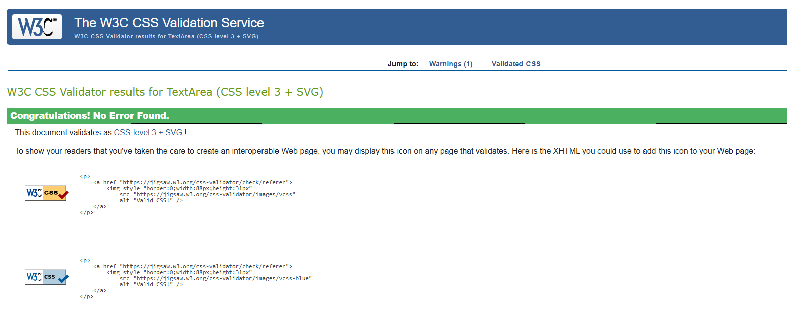
    
    - The following warning was shown, when the code was copied and validated, as line 2 contains the link to the Google Font:

  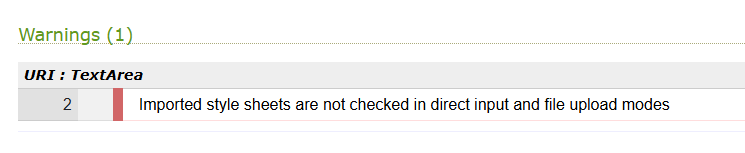
  
  - When the link was used to validate, no errors were shown:
  
  
  
    - 434 warnings were detected this way, all of them on line 5 (the universal selector). This has to do with the usage of Bootstrap:
    
  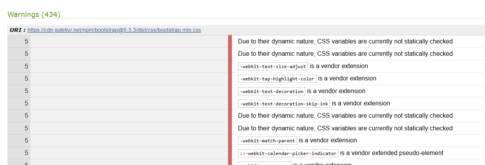

+ ### JavaScript

- [JSHint](https://jshint.com/) was used to validate JavaScript. `/* jshint esversion: 6 */` was added to ensure compatibility with ES6 (due to using module to call JavaScript files):

  - [main.js](assets/js/game.js) passed with no errors, except that bootstrap is not recognised as a defined variable:

  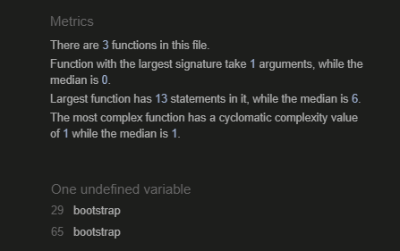

  *This could be avoided by adding ` /* global bootstrap */`*

  - [ui.js](assets/js/ui.js) passed with no errors:

  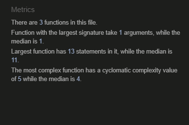

  - [game.js](assets/js/game.js) passed with no errors, except that bootstrap is not recognised as a defined variable as well as the following warning:

  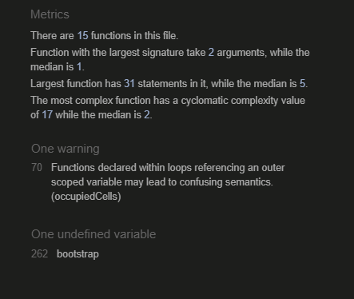

  *This could be avoided by adding ` /* global bootstrap */`*

  *Due to using `let` to define variables, this can be ignored, as `let` is block-scoped. Further, this warning is especially meant for older versions (pre-ES6)*

  - [events.js](assets/js/events.js) passed with no errors, except that bootstrap is not recognised as a defined variable:

  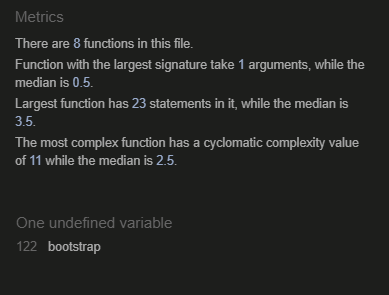

  *This could be avoided by adding ` /* global bootstrap */`*

  - [utils.js](assets/js/utils.js) passed with no errors:

  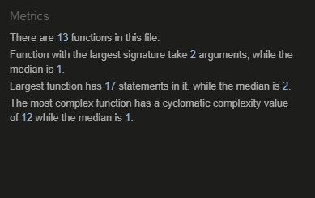

+ ## LightHouse report

    - Using lighthouse confirms the game/page performs well, follows best practices and is accessible:
    
  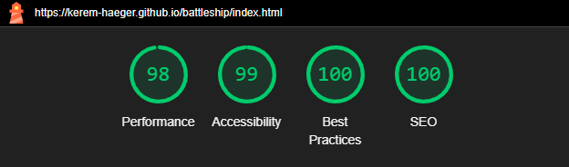

---
​
## Bugs
+ ### Solved bugs
    1. The testimonials pictures had a square shape in Brave browser on a mobile phone when the border radius had been set to 50%. It was due to the outline properties settings instead of the border
    
        *Solutions:* Outline was replaced with border properties.
    
    1. The gallery image descriptions were not appearing on the picture when hovering it as the position of the .image_content was set to fixed.
        
        *Solution:* The .image_content position was set to absolute, with the top: 0, left: 0, and added padding on the .image_content. 

    1. Footer on the contact page was reducing the size of the screen and shrank the contact form as the height of the background image was set to calc(100vh-the size of the footer)
        
        *Solution:* The height of the image was set to 100hv, and the display of the footer was set to fixed.

+ ### Unsolved bugs

    - None.

---