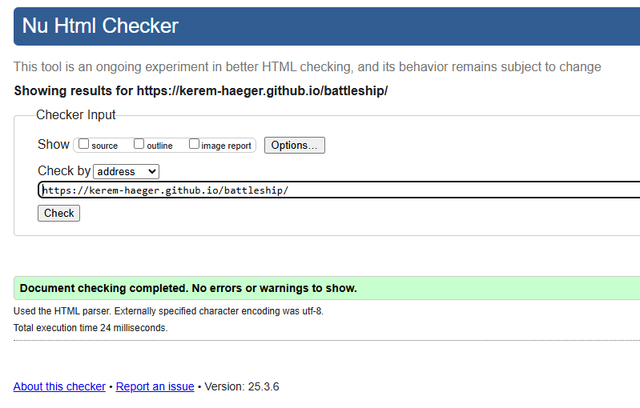
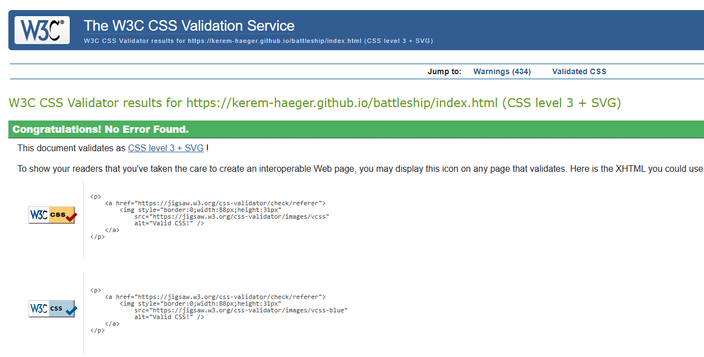

# TESTING

## Compatibility

In order to confirm the correct functionality, responsiveness, and appearance:

+ The website was tested on the following browsers: Chrome, Firefox, Opera.

    - Chrome:

    

    - FireFox:

    

    - Opera:

    

## Responsiveness

+ The website was checked using DevTools in browsers during development, but further using [Responsive Viewer](https://responsiveviewer.org/):

+ The functionality of the GitHub Link was checked and opened the correct page in a new tab.

## Manual testing

| Feature | Action | Expected Result | Tested | Passed | Comments |
| --- | --- | --- | --- | --- | --- |
| **Instruction Modal** | | | | | |
| Start Button | Click on the button | The modal is hidden and the game starts, first creating the player board | Yes | Yes | - |
|  | Clicking outside of the modal | No significant action should occur, the modal cannot be closed this way | Yes | Yes | - |
| **Main Game** | | | | | |
| Legend/Labels/Page | Click anywhere but the intended game area | Nothing should happen, elements outside the board should not be clickable | Yes | Yes | - |
| Player Board | Left-click on the board | Places player ship | Yes | Yes | - |
| Player Board | Hovering over the player board | Shows outline of ship, to indicate where it would be placed | Yes | Yes | - |
| Player Board | Right-click on the board | Rotates ship orientation (in hover) | Yes | Yes | Occasionally the mouse needs to be moved slightly for the effect to update |
| Computer Board | Left-click on the board | "Attacks" the computer, prompting either a hit or a miss and the corresponding graphic - This ends the player's turn| Yes | Yes | - |
| Computer Board | Left-click on a previously "attacked" cell | Player prompt updates, notifying the player to choose another cell - This does not end the player's turn | Yes | Yes | - |
| Computer Board | Right-click on the board | Nothing should happen, default prevented | Yes | Yes | - |
| **End Game Modal** | | | | | |
| Reset Button | Click on "Play again!" button | The game resets completely, allowing a clean restart | Yes | Yes | - |
|  | Clicking outside of the modal | No significant action should occur, the modal cannot be closed this way | Yes | Yes | - |
| **Footer** | | | | | |
| Link to GitHub | Click on "GitHub Page here" | The user is redirected to the GitHub page | Yes | Yes | - |
| GitHub Icon | Click on the GitHub icon | The user is redirected to the GitHub page | Yes | Yes | - |
| **Computer Logic** | | | | | |
| Computer Attack | - | The computer randomly attacks a cell, the relevant graphic is shown, the prompt is updated while the computer attacks | Yes | Yes | - |
| Computer Miss | - | The "miss" graphic is shown, the game continues as before | Yes | Yes | - |
| Computer Hit | - | The "hit" graphic is shown, the computer prioritises cells surrounding the hit cell for the next attacks, until the ship (3 cells) have been sunk | Yes | Yes | - |
| Computer Sinks Ship | - | The priority on adjecent cells gets reset and the computer continues to attack randomly | Yes | Yes | - |

---
## Validator testing
+ ### HTML
  
    - No errors or warnings were found when passing through the official W3C validator.

    

+ ### CSS
  - No errors were found when passing through the official W3C (Jigsaw) validator.

  
    
    - The following warning was shown when the code was copied and validated, as line 2 contains the link to the Google Font:

  
  
  - When the link was used to validate, no errors were shown:
  
  
  
    - 434 warnings were detected this way, all of them on line 5 (the universal selector). This has to do with the usage of Bootstrap:
    
  

+ ### JavaScript

- [JSHint](https://jshint.com/) was used to validate JavaScript. `/* jshint esversion: 6 */` was added to ensure compatibility with ES6 (due to using module to call JavaScript files):

  - [main.js](assets/js/game.js) passed with no errors, except that bootstrap is not recognised as a defined variable:

  

  *This could be avoided by adding ` /* global bootstrap */`*

  - [ui.js](assets/js/ui.js) passed with no errors:

  

  - [game.js](assets/js/game.js) passed with no errors, except that bootstrap is not recognised as a defined variable as well as the following warning:

  

  *This could be avoided by adding ` /* global bootstrap */`*

  *Due to using `let` to define variables, this can be ignored, as `let` is block-scoped. Further, this warning is especially meant for older versions (pre-ES6)*

  - [events.js](assets/js/events.js) passed with no errors, except that bootstrap is not recognised as a defined variable:

  

  *This could be avoided by adding ` /* global bootstrap */`*

  - [utils.js](assets/js/utils.js) passed with no errors:

  

+ ## LightHouse report

    - Using lighthouse confirms the game/page performs well, follows best practices and is accessible:
    
  

---
​
## Bugs

+ ### Solved bugs

    1. On restart, the game wouldn't reset properly, throwing different errors.
    
        *Solutions:* When resetting variables, arrays, and sets, they had to be reset in the file where they were declared. Thus, the resetGame function had to be split into multiple function, all called on when the player clicks "Play Again!".
        Ensure arrays were cleared correctly to be used again.
    
    2. Event Listeners were added multiple times after restart, not allowing proper rotation of ships.
        
        *Solution:* Check for listeners already added and only add them, when there weren't any detected.

    3. Ships weren't stored properly. The chosen variables were reassigned within a loop and therefore not retaining the correct positions.
        
        *Solution:* Declared ship arrays globally and cleared them using `.length = 0`

    4. On reset, the legend/label duplicated and `.appendChild()` threw an error.

        *Solution:* Instead of clearing the div with `.innerHTML = ''`, they are made temporarily invisible until they are used again.

+ ### Unsolved bugs

    - None.

---